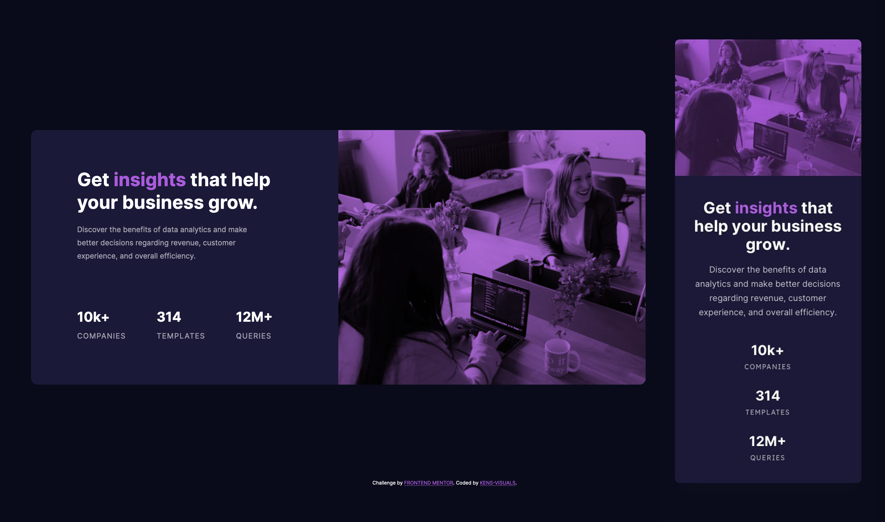

# Frontend Mentor - Stats Preview Card Component Solution

This is a solution to the [Stats preview card component challenge on Frontend Mentor](https://www.frontendmentor.io/challenges/stats-preview-card-component-8JqbgoU62).

## Table of contents

- [Overview](#overview)
  - [The challenge](#the-challenge)
  - [Screenshot](#screenshot)
  - [Links](#links)
- [My process](#my-process)
  - [Built with](#built-with)
  - [What I learned](#what-i-learned)
  - [Useful resources](#useful-resources)

## Overview

### The challenge

Users should be able to:

- View the optimal layout depending on their device's screen size

### Screenshot



### Links

- Solution URL: [TBU](https://your-solution-url.com)
- Live Site URL: [TBU](https://your-live-site-url.com)

## My process

### Built with

- Semantic HTML5 markup
- SCSS custom properties
- CSS Flexbox
- Mobile-first workflow

### What I learned

```css
.card__gradient-overlay {
  position: relative;

  &::after {
    content: '';
    width: 100%;
    height: 100%;
    position: absolute;
    top: 0;
    left: 0;
    background-color: $color-primary--light;
    mix-blend-mode: multiply;
    opacity: 0.9;
  }
}

.card__img {
  width: 100%;
  height: 100%;
  object-fit: cover;
}
```

### Useful resources

- [impressivewebs](https://www.impressivewebs.com/) - This website helped me to get some idea of how to add a color overlay on an image.
- [mix-blend-mode](https://developer.mozilla.org/en-US/docs/Web/CSS/mix-blend-mode) - This CSS property helped me to achieve the desirable result of getting as close to the original design as possible.

## Author

- Frontend Mentor - [@kens-visuals](https://www.frontendmentor.io/profile/kens-visuals)
- Codewars - [@kens_visuals](https://www.codewars.com/users/kens_visuals)
- CodePen - [@kens-visuals](https://codepen.io/kens-visuals)
